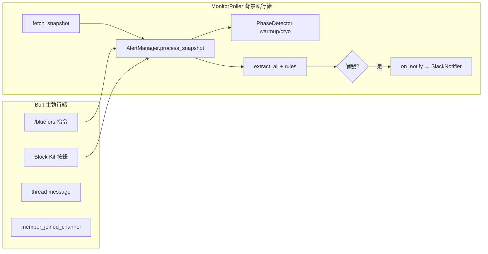

# Alarm Bot

Bluefors **Control Software Gen. 1** 即時監控服務：透過 Control API 輪詢 value tree，依 `config.yaml` 規則判斷異常，以 **Slack Bot** 發送分級示警，並支援頻道內互動操作與 JSONL 審計日誌。

> **開發者**：架構、測試、擴充指標與除錯見 [開發者指南](#開發者指南)。

## 功能

- 每輪監控僅一次 `GET /values/` 快照，解析 flat value tree
- 可設定多種監控指標（溫度、壓力 P1–P6、雙 CPA、turbo、流量、感測器連線、選用磁體等）
- 閾值示警、恢復通知、`sustain_polls` 連續確認、`cooldown` 防洗版、**`default_reminder_interval_seconds` / `reminder_interval_seconds` 未處理示警週期提醒**
- 使用者操作：mute / snooze / ack / ignore（Slash 指令、示警按鈕、thread 關鍵字）
- **升溫模式（warmup）**：維護／回溫期間抑制溫度、壓力、流量、感測器連線類示警；壓縮機與 turbo 仍示警
- **低溫模式**：僅兩種運行狀態（升溫中／低溫正常運行）；tmixing 達標或手動 `stop` 結束 warmup
- 選用指標（如磁體溫度）可依 `enabled_by_metric` 自動啟用追蹤
- Slash 指令 **`status` / `alerts` / `help`** 以 **Block Kit** 回覆，**全頻道可見**
- Bot 被邀請進頻道時自動發送使用說明
- Windows / Linux 可攜式打包（PyInstaller）
- Socket Mode，無需對外開放 HTTP 端口

## 前置需求

| 項目 | 說明 |
|------|------|
| Python | **3.13+**（開發模式或自行打包時） |
| 網路 | 監控主機可連線 Bluefors Control API（常見內網 `https://<ip>:49098`） |
| Bluefors | Gen. 1 Control Software，已建立 **read-only API key** |
| Slack | Workspace 管理權限，可建立 App 並安裝到 workspace |
| 作業系統 | Windows 10+ 或 Linux（建議常駐於可連 API 的機器） |

Bluefors 官方文件（User Manual / API Technical Reference）請依內部規範另行保存；目前此 repo **不內含** `manual/` PDF。

---

## 完整部署流程

以下為從零到上線的建議順序。開發測試可只做步驟 1–4；正式環境建議走完 1–7。

### 步驟 1：準備 Bluefors API

1. 在 Control Software 建立 **唯讀 API key**（具備讀取 value tree 權限）。
2. 確認監控主機可存取 API，例如：
   ```bash
   curl -k "https://192.168.1.10:49098/system/?key=YOUR_KEY"
   ```
3. （建議）匯出一份 snapshot JSON 供路徑校驗：
   ```bash
   curl -k "https://192.168.1.10:49098/values/?key=YOUR_KEY&recursion=-1&style=flat" -o values_snapshot.json
   ```

### 步驟 2：建立 Slack App

在 [api.slack.com](https://api.slack.com) 建立 App，依序完成：

1. **Socket Mode**：啟用，產生 `App-Level Token`（`xapp-...`，需 `connections:write`）。
2. **OAuth & Permissions → Bot Token Scopes**：
   - `chat:write` — 發送示警與回覆
   - `commands` — Slash 指令
   - `channels:history` — 讀取 thread（公開頻道）
   - `channels:read` — 接收 bot 加入頻道事件
   - `groups:history` — thread 回覆（私有頻道，選用）
   - `groups:read` — 私有頻道加入事件（選用）
3. **Install App** 到 workspace，取得 **Bot User OAuth Token**（`xoxb-...`）。
4. **Slash Commands**：新增 `/bluefors`（Request URL 在 Socket Mode 下可填佔位，實際由 Socket 處理）。
5. **Interactivity**：啟用（示警 Block Kit 按鈕需要）。
6. **Event Subscriptions → Subscribe to bot events**：
   - `message.channels`（公開頻道 thread 指令；私有頻道改 `message.groups`）
   - `member_joined_channel`（bot 加入頻道時發送說明）
7. 建立示警頻道，記下 **Channel ID**（Slack 頻道詳情 → 最下方，或以 API 查詢）。
8. 將 Bot **邀請進示警頻道**（`/invite @你的Bot`）。首次邀請會自動發送指令說明。

> 若變更 OAuth scope 或 Bot Events，需重新安裝 App 到 workspace。

### 步驟 3：取得程式

**方式 A — 開發模式（建議先驗證）**

```bash
git clone <repo-url>
cd RES_Bluefors_Alarm_Bot
python -m venv .venv
# Windows: .venv\Scripts\activate
# Linux:   source .venv/bin/activate
pip install -e .
```

**方式 B — 可攜式打包（正式部署）**

```powershell
# Windows
.\scripts\build.ps1
```

```bash
# Linux
chmod +x scripts/build.sh
./scripts/build.sh
```

產出目錄：`dist/alarm-bot/`（內含 `alarm-bot` 或 `alarm-bot.exe`、`config.yaml`、`.env` 範本）。

### 步驟 4：初始化設定

在**專案根目錄**（開發）或 **`dist/alarm-bot/`**（打包）執行：

```bash
alarm-bot setup
# 或
python -m alarm_bot.cli setup
```

互動式精靈會建立／更新 `.env`，並執行 Bluefors + Slack 連線測試。必填項：

| 變數 | 說明 |
|------|------|
| `BLUEFORS_BASE_URL` | 例 `https://192.168.1.10:49098` |
| `BLUEFORS_API_KEY` | 唯讀 API key |
| `BLUEFORS_VERIFY_SSL` | 內網自簽憑證通常 `false` |
| `SLACK_BOT_TOKEN` | `xoxb-...` |
| `SLACK_APP_TOKEN` | `xapp-...` |
| `SLACK_ALERT_CHANNEL_ID` | 示警頻道 ID（`C...`） |
| `POLL_INTERVAL_SECONDS` | 輪詢間隔，預設 `30` |

選填：

| 變數 | 說明 |
|------|------|
| `BLUEFORS_SNAPSHOT_BRANCH` | 只訂閱 value tree 子樹時填入（多數情況留空） |
| `CONFIG_PATH` | 設定檔路徑，預設同目錄 `config.yaml` |
| `LOG_LEVEL` | 例 `INFO`、`DEBUG` |
| `APP_LOG_PATH` | 預設 `logs/app.log` |
| `AUDIT_LOG_PATH` | 預設 `logs/audit.jsonl` |

`setup` 若缺少 `.env` 或 `config.yaml` 會自動產生預設檔。

### 步驟 5：調整 `config.yaml`

1. **確認 `value_path`**：各 metric 的 path 必須存在於實機 snapshot。
   ```bash
   alarm-bot suggest-paths --snapshot values_snapshot.json
   ```
   或啟動後在 Slack 執行 `/bluefors paths` 檢查 `OK` / `NOT FOUND`。
2. **調整規則**：`rules`（閾值、`sustain_polls`）、`recovery.hysteresis`、`cooldown_seconds`、`reminder_interval_seconds`。
3. **升溫／低溫**：`operating_phases` 區塊（見下方「升溫模式」）；僅含 `warmup` 與 `cryo_normal`，無額外運行階段判斷。
4. **選用硬體**：如磁體相關 metric 設 `optional: true`，並以 `enabled_by_metric` 控制是否追蹤。

`config.yaml` 與 `.env` 必須與執行檔**同一目錄**（打包後即 `dist/alarm-bot/`）。

### 步驟 6：驗證與啟動

```bash
alarm-bot check    # 僅測連線，不啟動 bot
alarm-bot run      # 啟動輪詢 + Slack Socket Mode
```

啟動成功後日誌會顯示 `Bluefors Alarm Bot running (Socket Mode)`。

**建議驗收清單：**

- [ ] `/bluefors status` 在頻道顯示 Block Kit 分區讀數（溫度／壓力／…）
- [ ] `/bluefors help`、`/bluefors alerts` 同樣為區塊訊息且全頻道可見
- [ ] `/bluefors paths` 無 `NOT FOUND`（或僅預期的 optional 項目）
- [ ] 測試頻道收到 bot 歡迎訊息（重新 invite 可觸發）
- [ ] 人為觸發一則示警（或暫時調低閾值）確認 Slack 通知與按鈕
- [ ] `logs/audit.jsonl` 有 `poll.success` 等事件

### 步驟 7：正式環境常駐

**Linux（systemd）**

```bash
sudo cp -r dist/alarm-bot /opt/alarm-bot
cd /opt/alarm-bot && ./alarm-bot setup   # 或手動編輯 .env
sudo cp scripts/alarm-bot.service /etc/systemd/system/
# 編輯 WorkingDirectory=/opt/alarm-bot、ExecStart=/opt/alarm-bot/alarm-bot run
sudo systemctl daemon-reload
sudo systemctl enable --now alarm-bot
sudo systemctl status alarm-bot
```

**Windows**

- 以工作排程器或 NSSM 將 `dist\alarm-bot\alarm-bot.exe run` 設為開機啟動。
- 工作目錄設為 `dist\alarm-bot\`（需含 `config.yaml`、`.env`）。

**換機器**

1. 複製整個 `dist/alarm-bot/`（含 `state/`、`logs/` 若需保留示警狀態）。
2. 網路或密鑰變更時重新 `alarm-bot setup` 或編輯 `.env`。
3. 執行 `alarm-bot check` 後 `alarm-bot run`。

---

## 快速開始（開發模式）

若已完成「步驟 1–2」（且已進入 venv），可精簡為：

```bash
pip install -e .
alarm-bot setup
alarm-bot run
```

---

## CLI 指令

| 指令 | 說明 |
|------|------|
| `alarm-bot setup` | 首次初始化：建立設定檔、互動填寫 `.env`、連線測試 |
| `alarm-bot run` | 啟動 Bluefors 輪詢與 Slack Bot |
| `alarm-bot check` | 驗證設定完整性並測試 API / Slack |
| `alarm-bot suggest-paths --snapshot <file>` | 依 snapshot JSON 建議 `value_path` |

亦可使用 `python -m alarm_bot.cli <子指令>`。

---

## Control API

每輪監控發送一次請求（路徑與參數由 client 組裝）：

```http
GET {BASE_URL}/values/?key={API_KEY}&recursion=-1&style=flat&fields=...
```

若設定 `BLUEFORS_SNAPSHOT_BRANCH`，則改為 `GET {BASE_URL}/values/{branch}/?...`。

首次部署請以 snapshot 探勘 `value_path`，對照 User Manual Appendix II（如 `tmixing`、`cpatempwi`）。專案內 `alarm_bot/bluefors/api_spec.md` 亦有 API 摘要。

---

## Slack 使用說明

### Slash 指令回覆方式

所有 `/bluefors` 回覆皆使用 `response_type="in_channel"`（頻道內所有人可見）。

| 子指令 | 回覆格式 | 可見性 |
|--------|----------|--------|
| `help` | Block Kit（分區說明） | 全頻道 |
| `status` / `status <metric_id>` | Block Kit（見下方範例） | 全頻道 |
| `alerts` | Block Kit（每則示警一區塊，最多 20 筆） | 全頻道 |
| 其餘子指令 | 純文字 | 全頻道 |

### Slash 指令一覽

| 指令 | 功能 |
|------|------|
| `help` | 完整說明（預設） |
| `status` | 即時監控讀數（Block Kit，依 category 分區） |
| `status <metric_id>` | 單一指標（Block Kit） |
| `paths` | 檢查 `value_path` 是否存在於最新 snapshot |
| `alerts` | 進行中示警（Block Kit） |
| `phase` | 運行狀態（升溫 / 低溫）與升溫詳情 |
| `warmup` | 升溫模式狀態 |
| `warmup start [備註]` | 手動啟動升溫模式 |
| `warmup stop` | 手動結束升溫模式，恢復完整監控 |
| `policy` | warmup + mute + snooze 總覽 |
| `muted` / `snoozed` | 已關閉或暫停通知的指標 |
| `ack <alert_id>` | 確認示警 |
| `ignore <alert_id>` | 忽略此次異常 |
| `snooze <metric_id> <分鐘>` | 暫時靜音 |
| `mute <metric_id>` / `unmute <metric_id>` | 關閉／開啟指標警報 |
| `mute-all` / `unmute-all` | 全部關閉／開啟 |
| `clear [confirm]` | 清除所有 alerts/state（含 mute、snooze、warmup；危險操作） |
| `history [alert_id]` | 最近審計事件 |
| `notifications` | Control Software 內建 notifications |

### `/bluefors status` 輸出範例

Block Kit 版面（摘要）：

```
┌ Bluefors 即時狀態 ─────────────────────┐
│ 運行: 低溫模式 | 進行中示警: 1          │
│ 系統: Lab | 版本: 10.0                  │
├ 溫度 ──────────────────────────────────┤
│ • MXC 溫度: 0.05 K                      │
│ • 50K 溫度: 37 K                        │
│ • …                                     │
├ 壓力 ──────────────────────────────────┤
│ • 壓力 P1: …                            │
├ …（流量、壓縮機、Turbo、感測器連線）────┤
│ 快照時間: 2026-07-01 20:30              │
└────────────────────────────────────────┘
```

顯示規則：

- 指標依 **category** 分區：溫度 → 壓力 → 流量 → 壓縮機 → Turbo → 感測器連線
- 頂部顯示 **運行模式**（升溫／低溫）與 **進行中示警數**
- 一般數值指標**不**顯示 `(SYNCHRONIZED)`；感測器連線類或異常 status 才顯示
- `optional` 且未安裝的指標會略過
- 快照時間為**本地時間** `YYYY-MM-DD HH:MM`
- 顯示值經 `value_formatter` 統一轉換（見下表）

#### 顯示值 Formatter 規則（`alarm_bot/value_formatter.py`）

| 條件 | 顯示格式 |
|------|----------|
| `unit == "K"` 且 `value >= 1` | `x.xxx K` |
| `unit == "K"` 且 `value < 1` | 轉換為 `x.xxx mK`（值 × 1000） |
| `unit == "°C"` | `x.xx °C` |
| `category == pressure` | 轉 `mbar`（值 × 1000）並用科學記號 `x.xxxe±yy mbar` |
| `category == flow` | `x.xx`（保留 2 位） |
| `category == compressor` 且 `metric_id` 結尾為 `_error` 且值為 `0` | `no error` |
| `category == turbo` 且 `value_type == enum` | 顯示 `enum_values` label（如 `off` / `running` / `error`），不顯示數字 |

Formatter 套用範圍：

- `/bluefors status`（Block）
- `/bluefors status <metric_id>`（Block）
- 示警建立 / 提醒 / 恢復訊息中的 `value`
- `metric.evaluated` 審計事件中的 `value`

示警 thread 內按「查看即時狀態」或輸入 `status` 關鍵字，目前仍為**純文字**條列（與 Slash `status` 的 Block 版面不同）。

### 示警訊息按鈕

- 確認已知悉、忽略此次、關閉此指標警報
- 查看即時狀態
- **啟動升溫模式**
- 靜音下拉選單（5 / 10 / 30 / 60 分鐘、4 小時）

### Thread 關鍵字

在示警 thread 內輸入（支援中英文）：

`status` / `狀態`、`ack` / `確認`、`ignore` / `忽略`、`mute` / `關閉`、`snooze 60`、`help`

### 頻道歡迎訊息

Bot 被 invite 進頻道時（`member_joined_channel`），會自動發送歡迎文字與完整 `HELP_TEXT` 指令說明。

---

## 升溫模式（Warmup）

維護或回溫時，溫度／壓力／流量規則容易誤觸發。系統**僅區分兩種運行狀態**（無 room_temp、transition 等額外階段）：

| 狀態 | 說明 |
|------|------|
| **升溫模式** | `warmup_mode.active = true`，抑制部分 category 示警 |
| **低溫模式** | `warmup_mode.active = false`，完整監控 |

### 進入升溫模式

1. `/bluefors warmup start` 或示警上的「啟動升溫模式」按鈕（手動）
2. **t50k > 100 K**（可設定）連續 N 輪 → 自動啟動
3. **4K heater** 由 off → on（`mapper.bf.heaters.heater` → `1`，可設定）→ 自動啟動

### 升溫期間

抑制 `temperature`、`pressure`、`flow`、`sensor_connection` 類別；**壓縮機錯誤碼與 turbo 仍會示警**。

### 結束升溫（進入低溫模式）

1. **tmixing < 100 mK**（`cryo_normal.tmixing_max_k`，預設 0.1 K）連續 N 輪 → 自動結束
2. `/bluefors warmup stop` 手動結束

Slack 行為：啟動時發送升溫 label；進入低溫模式時更新同一則訊息（自動時另發公告）。

### `operating_phases` 設定

```yaml
operating_phases:
  temperature_paths:    # t50k / t4k / tstill / tmixing
  warmup:
    auto_start_enabled: true
    auto_start_t50k_k: 100.0
    auto_start_sustain_polls: 3
    heater_4k: ...
  cryo_normal:
    tmixing_max_k: 0.1
    sustain_polls: 3
```

與 mute / snooze / cooldown 獨立運作。`ACTIVE` 且未 ack/ignore 時，依 `default_reminder_interval_seconds`（可由 metric 的 `reminder_interval_seconds` 覆寫）在原示警 thread 發提醒。溫度讀值若為 **over-range**，一律視為**無效**，不參與自動 warmup／低溫判定。

---

## `config.yaml` 概要

```yaml
bluefors:          # 連線預設（多數由 .env 覆寫）
operating_phases:  # warmup 自動啟動、cryo_normal 低溫判定、溫度 path
logging:           # 日誌路徑與輪替
slack:             # mention_channel_on_critical、default_reminder_interval_seconds 等
metrics:           # 監控指標清單
  - id: ...
    value_path: ...
    category: temperature | pressure | flow | compressor | turbo | sensor_connection
    rules: ...
    cooldown_seconds: 300   # 恢復後再次觸發示警的最短間隔（秒）
    reminder_interval_seconds: 900  # 可選；覆寫全域提醒間隔；0 = 關閉此指標提醒
    optional: true          # 硬體未安裝時可略過
    enabled_by_metric: ...  # 依其他指標讀值決定是否追蹤
```

`category` 同時影響 warmup 抑制與 `/bluefors status` 的分區顯示。

---

## 審計日誌

| 檔案 | 內容 |
|------|------|
| `logs/audit.jsonl` | 結構化事件（輪詢、示警、Slack 操作、warmup） |
| `logs/app.log` | 程式運行日誌 |

示警與 mute 狀態持久化於 `state/alerts.json`。日誌與 state 皆在執行目錄下，便於備份與搬移。

---

## 打包部署參考

打包後請在 **`dist/alarm-bot/`** 目錄內操作：

```bash
cd dist/alarm-bot
./alarm-bot setup    # Windows: alarm-bot.exe setup
./alarm-bot run
```

開發時亦可從專案根目錄使用：

- Linux: `scripts/setup.sh`、`scripts/run.sh`
- Windows: `scripts/setup.bat`、`scripts/run.bat`

上述腳本會優先呼叫 repo 內的 `alarm-bot(.exe)`，若不存在則改用 venv Python。

打包腳本會將現有的 `config.yaml`、`.env`（若存在）複製進 `dist/alarm-bot/`；正式環境建議在目標機器上重新 `setup` 填入密鑰。

---

## 專案結構

```
alarm_bot/
  bluefors/         # Control API 客戶端、snapshot 解析
  monitoring/       # 輪詢、規則、示警、升溫／低溫邏輯
  slack/            # Bolt App、指令、Block Kit、通知
  logging/          # 審計日誌
  state/            # 示警與 warmup 狀態持久化
  cli.py            # setup / run / check / suggest-paths
  bootstrap.py      # 啟動與健康檢查
config.yaml         # 監控規則（與執行檔同目錄）
.env                # 密鑰與連線（勿提交版控）
logs/               # 運行時產生
state/              # alerts.json
 manual/             # （可選）自行放置內部 Bluefors 文件
scripts/            # build、setup、run、systemd unit
tests/              # pytest 單元測試
```

---

## 開發者指南

本章面向要修改程式、擴充規則或除錯的開發者。部署與 Slack 操作細節見上文各節。

### 架構與執行流程

`alarm-bot run` 啟動後，主執行緒跑 **Slack Socket Mode**（Bolt），背景執行緒跑 **MonitorPoller**：



**單輪 poll 順序**（`alert_manager.process_snapshot`）：

1. `PhaseDetector.build_phase_snapshot` — 讀溫度、判斷自動 warmup／低溫
2. `_handle_phase_and_warmup` — 可能啟動／結束 warmup（`on_warmup_notify`）
3. 對每個 metric：`should_track_metric` → `evaluate_metric` → 建立／恢復示警
4. `state.save()` 寫入 `state/alerts.json`

Slack 互動（指令、按鈕、thread）直接呼叫 `AlertManager` / `SlackNotifier`，不經 poller。

### 模組職責

| 路徑 | 職責 |
|------|------|
| `alarm_bot/bootstrap.py` | 組裝 `AppContext`、健康檢查、預設 `config.yaml` 模板 |
| `alarm_bot/paths.py` | `BASE_DIR`：開發時為 repo 根目錄，PyInstaller 打包後為 exe 所在目錄 |
| `alarm_bot/config.py` | Pydantic 模型：`MetricConfig`、`OperatingPhasesConfig`、`EnvSettings` |
| `alarm_bot/bluefors/client.py` | HTTP 客戶端：`system/`、`values/`、`notifications` |
| `alarm_bot/bluefors/extractor.py` | 從 flat snapshot 解析 `MetricReading`；含 `VALUE_PATH_ALIASES` |
| `alarm_bot/monitoring/poller.py` | 定時 `poll_once`，寫 `poll.*` 審計 |
| `alarm_bot/monitoring/rules.py` | 規則評估、`sustain_polls`、恢復遲滯 |
| `alarm_bot/monitoring/alert_manager.py` | 示警狀態機、cooldown、reminder、mute/snooze、warmup 抑制 |
| `alarm_bot/monitoring/phase_detector.py` | warmup 自動啟動、t50k／4K heater、tmixing 低溫判定 |
| `alarm_bot/monitoring/metric_tracking.py` | `optional`、`enabled_by_metric` 追蹤邏輯 |
| `alarm_bot/state/store.py` | `alerts.json` 持久化、warmup 狀態 |
| `alarm_bot/slack/app.py` | Bolt 註冊：指令、按鈕、thread、頻道歡迎 |
| `alarm_bot/slack/commands.py` | `/bluefors` 分派、`respond_in_channel` |
| `alarm_bot/slack/messages.py` | Block Kit builders、`HELP_TEXT`、`SlashResponse` |
| `alarm_bot/slack/actions.py` | Block Kit `action_id` 處理 |
| `alarm_bot/slack/notifier.py` | `chat_postMessage`、示警／恢復／warmup 訊息 |
| `alarm_bot/path_suggester.py` | `suggest-paths` CLI |
| `alarm_bot/logging/audit.py` | JSONL 審計、輪替 |

### Slack 訊息建構（`messages.py`）

| 函式 | 用途 |
|------|------|
| `build_alert_blocks` | 示警主訊息（含按鈕、靜音選單） |
| `build_status_blocks` | `/bluefors status` 全量讀數 |
| `build_status_single_blocks` | `/bluefors status <metric_id>` |
| `build_alerts_list_blocks` | `/bluefors alerts` |
| `build_help_blocks` | `/bluefors help` |
| `build_status_text` | thread「查看狀態」純文字版 |
| `SlashResponse` | `{ text, blocks? }`，供 `respond_in_channel` 使用 |

`commands.py` 的 `respond_in_channel()` 對所有 Slash 回覆加上 `response_type="in_channel"`。

### 本地開發環境

```bash
python -m venv .venv
pip install -e ".[dev]"
alarm-bot setup
```

建議工作流：

1. 用 snapshot 跑 `alarm-bot suggest-paths` 校 path
2. 改程式後跑 `pytest`
3. `alarm-bot check` → `alarm-bot run` 於測試頻道驗證 Block 回覆

**設定優先順序**：`.env` 覆寫 `config.yaml` 的 Bluefors 連線；密鑰放 `.env`，規則放 `config.yaml`。

### 測試

```bash
pytest tests/ -q
```

| 測試檔 | 涵蓋範圍 |
|--------|----------|
| `test_rules.py` | 規則條件、severity、`sustain_polls` |
| `test_extractor.py` | snapshot 解析、path 別名 |
| `test_path_suggester.py` | path 建議 CLI |
| `test_phase_detector.py` | 自動 warmup、cryo_normal、over-range |
| `test_warmup.py` | warmup 抑制、自動啟停 |
| `test_alert_reminders.py` | reminder 週期提醒與 thread 回覆 |
| `test_metric_tracking.py` | `optional`、`enabled_by_metric` |
| `test_status_messages.py` | status 分區文字、Block builders、help/alerts |
| `test_commands.py` | Slash 指令分派與回覆行為 |
| `test_audit.py` | 審計寫入與查詢 |

### 新增或修改監控指標

1. 在 `config.yaml` 的 `metrics` 新增一筆。
2. 確認 `value_path`（`suggest-paths` 或 `/bluefors paths`）。
3. 設定 `category`（影響 warmup 抑制與 status 分區）。
4. 選用硬體：`optional: true` + `enabled_by_metric`。

### 規則引擎（`rules.py`）

| `condition` | 說明 |
|-------------|------|
| `above` / `below` | 數值比較 |
| `equals` / `not_equals` | 字串或 enum |
| `outside_range` | `threshold: [low, high]` |
| `status_not_in` | 感測器連線類 |

- **`sustain_polls`**：連續 N 輪命中才觸發
- **`recovery.hysteresis`**：恢復遲滯
- **`cooldown_seconds`**：恢復後再次觸發同一 metric 示警的最短間隔（重啟重置 in-memory 計時）
- **`default_reminder_interval_seconds`**（`slack` 區塊）：`ACTIVE` 示警未處理時，於原 thread 重複提醒的預設間隔（秒）；`0` = 關閉
- **`reminder_interval_seconds`**（單一 metric，可選）：覆寫全域提醒間隔；`0` = 關閉該指標提醒

### 擴充 Slack 互動

| 需求 | 修改位置 |
|------|----------|
| 新 Slash 子指令 | `commands.py` → `_dispatch`；說明更新 `HELP_TEXT`（`messages.py`） |
| 新 Block 回覆 | `messages.py` 新增 `build_*_blocks`，回傳 `SlashResponse` |
| 新示警按鈕 | `messages.py` + `actions.py` |
| Thread 關鍵字 | `thread_handler.py` + `app.py` |
| 頻道歡迎 | `app.py` → `_register_channel_welcome` |

### 審計事件（`logging/events.py`）

含 `poll.*`、`alert.*`、`warmup.started`、`warmup.base_temp_entered`、`slack.*` 等。查詢：`/bluefors history`。

### 打包（開發者）

```bash
pip install -e ".[dev]"
./scripts/build.sh   # 或 build.ps1
```

產物在 `dist/alarm-bot/`；於該目錄執行 `./alarm-bot run`。

---

## 故障排除

| 問題 | 處理 |
|------|------|
| `value path not found` | `/bluefors paths` 或 `alarm-bot suggest-paths` |
| Slack `not_in_channel` | 將 Bot 邀請進示警頻道 |
| Slash 指令無回應 | Socket Mode、`SLACK_APP_TOKEN`、App 已安裝 |
| 按鈕無反應 | 啟用 Interactivity |
| Thread 關鍵字無效 | 訂閱 `message.channels` / `message.groups` |
| Bot 加入頻道無歡迎訊息 | 訂閱 `member_joined_channel`、`channels:read` |
| API SSL 錯誤 | `BLUEFORS_VERIFY_SSL=false` |
| 重複示警洗版 | 調高 `cooldown_seconds` 或 snooze/mute；調整 `default_reminder_interval_seconds` |
| 示警後沒有第二次提醒 | 確認示警仍為 `ACTIVE`（ack/ignore 後不提醒）；檢查 `default_reminder_interval_seconds` 或該 metric 的 `reminder_interval_seconds` 是否為 `0` |
| 升溫期間仍收到溫度示警 | 確認 `category` 與 warmup 是否啟動 |
| status 訊息太長被截斷 | Slack 單則上限 50 blocks；可改用 `status <metric_id>` |

---

## 授權

本專案採 **Internal Use Only License**（見 `LICENSE`），僅供授權之組織內部使用。
任何對外散布、轉授權、販售或外部商業使用，皆需事先取得著作權人書面同意。
Bluefors 文件若另有授權限制，請一併遵守其使用條款。
